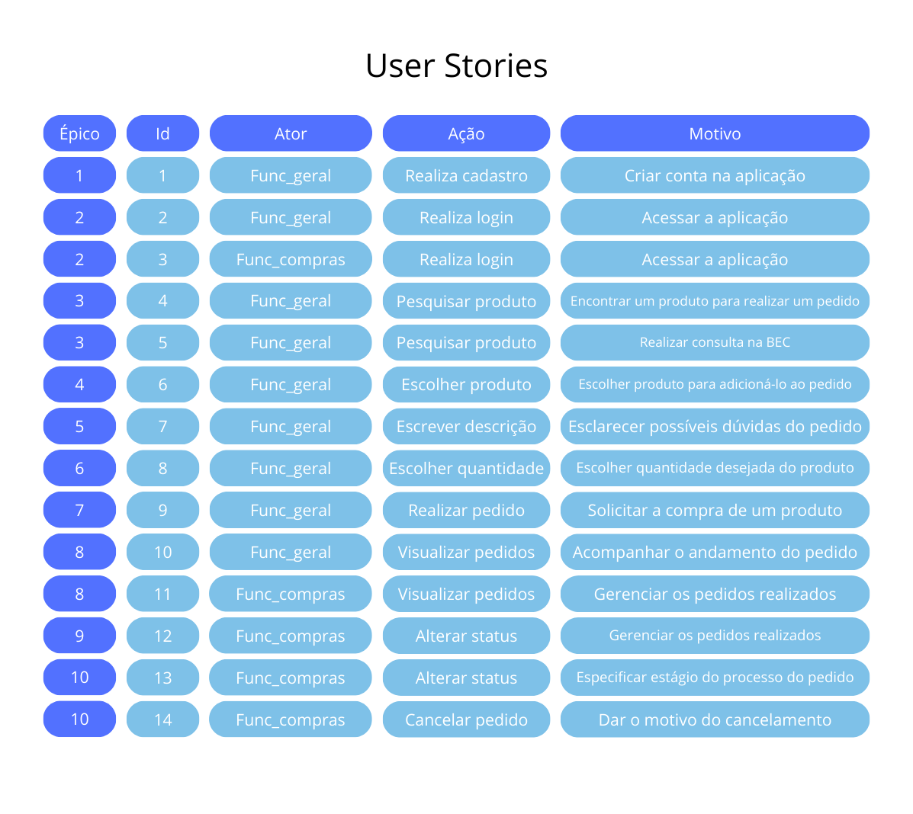

# Projeto de Compras 
<br id="topo">
<p align="center">
    <a href="#sobre">Sobre</a>  |  
    <a href="#backlogs">Backlogs & User Stories</a>  |
    <a href="#prototipo">Protótipo & Documentação</a>  | 
    <a href="#link">Links Uteis</a>  |
    <a href="#tecnologias">Tecnologias</a>  |  
    <a href="#equipe">Equipe</a>  |
     
    
</p>

<span id="sobre">

## :bookmark_tabs: Sobre
A partir de pedidos do administrativo da Faculdade Técnica de Votorantim, o desenvolvimento do site para facilitar o trabalho do funcionário responsável pelo trabalho de compras, consiste em um sistema de 2 frentes: a do **funcionário geral**, que pode gerar um pedido para um produto e acompanhar o andamento do pedido e o **funcionário de compras**, que visualiza pedidos realizados e os processa, mantendo o **funcionário geral** informado.

>_Projeto baseado na metodologia ágil SCRUM, procurando desenvolver a Produtividade e Colaboração entre funcionários da instituição_

Baseado em necessidades apontadas por funcionários, o usuário utilizará o sistema para armazenar dados que serão utilizados posteriormente em um novo pedido de compra, de forma que organize opções de compras e otimize tempo de pesquisa.

A partir desta ideia, o aplicativo utiliza de uma API desenvolvida para cadastrar produtos, sendo permitida a consulta, inclusão, mudança e exclusão de cada um.


:pushpin: Status do Projeto: **✔️ Concluído** 

### 🏁 Entregas de Sprints
| Sprint | Previsão | Status | Histórico |
|:--:|:----------:|:----------------|:-------------------------------------------------:|
| 01 | 20/05/2024 |  ✔️Concluído    |[ver relatório](https://github.com/paulovictorio/Documentacao_projetoCompras/blob/sprint-01/README.md)|
| 02 | 03/06/2024 |  ✔️Concluído    |[ver relatório](https://github.com/paulovictorio/Documentacao_projetoCompras/blob/sprint-02/README.md)|
| 03 | 17/06/2024 |  ✔️Concluído    |[ver relatório](https://github.com/paulovictorio/Documentacao_projetoCompras/blob/sprint-03/README.md)|

### :clapper: Apresentação Final
Confira a seguir uma demonstraão das funcionalidades para cada tipo de usuário do sistema:
<details>
   <summary>Diretor de Serviços Administrativos</summary>
    <div align="center">
        
    </div>
</details>
<details>
   <summary>Funcionários</summary>
    <div align="center">
          
    </div>
</details>
    
→ [Voltar ao topo](#topo)

<span id="backlogs">
    
## 👷 Backlogs & User Stories
### Requisitos Funcionais

| ID |      Título      |                    Descrição                         |            Exceções            |
|:--:|:-----------------:|:---------------------------------------------------:|:------------------------------:|
| RF01 | Realizar Cadastro | Caixas de texto para nome, email e senha | Alerta para email já existente |
| | | Botão de criar conta | Alerta para erro no cadastro |
| | | Botão para retornar à página inicial | |
| RF02 | Realizar Login | Caixas de texto para email e senha | Mensagem para usuário ou senha incorretos |
| | | Botão para entrar no sistema | Alerta para erro no login |
| | | Caixa "Lembrar senha" | |
| | | Botão "ir para cadastro" | |
| RF03 | Rodapé | Botões de acesso à página de requisição, histórico e sair do sistema (usuário) | |
| | | Botões de acesso à página de criar um novo admin, histórico e sair do sistema (admin) | |
| RF04 | Requisitar produto | Caixa de texto para pesquisar produto | Alerta para erro na requisição |
| | | Caixa de texto para pesquisar categoria | |
| | | Caixas de texto para quantidade e descrição | | 
| | | Botão para envio da requisição | |
| RF05 | Visualização do histórico de pedidos | Caixa contendo dados do pedido | |
| | | Visualização do status do produto | |
| RF06 | Editar um pedido pendente (usuário) | Caixas de texto para quantidade, categoria, tipo e descrição | Alerta para erro na exclusão | 
| | | Botão para excluir pedido | Alerta para erro na confirmação da edição |
| | | Confirmação da exclusão | |
| | | Confirmação da edição | |
| RF07 | Visualização dos detalhes de um pedido | Botão para ver detalhes | Alerta para erro na visualização dos detalhes |
| | | Botão para voltar ao histórico | |
| RF08 | Visualização da justificativa de um pedido negado | Botão para ver justificativa | Alerta para erro na visualização da justificativa |
| | | Botão para voltar ao histórico | Alerta para erro no envio da justificativa |
| | | Botão para confirmar justificativa (administrador) | | 
| | | Caixa de texto para descrever justificativa (administrador) | |
| RF09 | Cadastro de novo usuário administrador | Caixas de texto para nome, email e senha | Alerta para erro ao criar conta |
| | | Botão para criar conta | Alerta para email já existente |
| RF10 | Lista de usuários administradores | Caixa contendo dados de nome e email | Alerta para erro ao excluir usuário |
| | | Botão para excluir usuário | |

 ### Requisitos Não Funcionais
|   ID  |  Título  |
|:-----:|:------:|
| RNF01 | Linguagens JavaScript e React Native |
| RNF02 | Uso da biblioteca expo dev |
| RNF03 | Uso de Banco de Dados SQLite para dados de usuários e requisições |
| RNF04 | Uso da API de pesquisa da BEC |
| RNF05 | Criptografia da senha dos usuários | 
| RNF06 | Segurança contra injeção de SQL |
| RNF07 | Sistema ativo a todo o tempo |
| RNF08 | Responsividade entre diferentes dispositivos móveis |
| RNF09 | Autenticação do usuário por SPA |
 
<div align="center">
    
</div>

→ [Voltar ao topo](#topo)

    
## Protótipo e Documentação
### 🏠 Protótipo 
<span id="prototipo">
    Com base nos dados coletados em pesquisas, foi possível montar um protótipo de alta fidelidade com o uso da ferramenta Figma. Esta ferramenta possibilitou uma visualização prévia do front-end do projeto, o suficiente para obter o alinhamento entre a equipe de desenvolvimento e o cliente. Desta forma, o projeto prototipado possui algumas funções básicas de acesso a telas e respostas a cliques em botões, posteriormente sendo funcionalidades aplicadas na própria aplicação.
    O acesso ao protótipo pode ser feito <a href="https://www.figma.com/proto/aoRbpLGfGNXeTD0hLtrsDr/Projeto-Integrador?node-id=0-1&t=P5UiG1z4EAXU1bLR-1">aqui</a>

### 🐳 Docker
<span id="docker">
    Este projeto também possui contêineres e imagens docker, permitindo replicar o software tal como planejado. Para isso, se encontram em cada repositório Frontend e Backend um arquivo Dockerfile, que contém instruções gerais de como inicializar o projeto, e um arquivo docker-compose, que possui uma forma automatizada de inicializar o projeto.
    Para gerar e iniciar uma imagem e container docker, basta inserir em um terminal aberto para cada repositório:
    
```bash
docker-compose up --build
``` 
    

### 📄 Documentação 
As documentações deste projeto possuem mais detalhes do planejamento e da arquitetura do software. 
Elas podem ser acessadas pelos links: [Documentação do projeto](documentacao_compras_pi.pdf)
E [Documentação ihc](ihc_compras.pdf). <br>

<span id="link">
    
> 🔗 **Links gerais** <br>
> - Link do sistema funcional: [clique aqui para acessar](https://projeto-mvc-restful-frontend.vercel.app)
> - Repositório do projeto: [clique aqui para acessar](https://github.com/thiago-diegoli/Projeto-MVC-RESTful)


## 🛠️ Tecnologias Utilizadas 
<span id="tecnologias">
    <p align="center">
      <a href="https://skillicons.dev">
    
  </a>
</p>
</span>


## :busts_in_silhouette: Equipe


<span id="equipe">
    

|    Função     |                  Nome                 |                          GitHub                              | 
| :-----------: | :-----------------------------------: | :----------------------------------------------------------: |
| Product Owner | Eduardo Brando Almeida                |[](https://github.com/Eduardo-Brando-Almeida)|
| Dev Team | Paulo César Ap. Q. V. Victório             |[](https://github.com/paulovictorio)|
| Dev Team  | Felipe Thiago da Silva                    |[](https://github.com/Felipe-Thiago)|
| Dev Team | Thiago Saldanha Diegoli                    |[](https://github.com/thiago-diegoli)|
| Dev Team | Yara Paes de Bona                          |[](https://github.com/YaraPaesB)|

→ [Voltar ao topo](#topo)


## 🪪 Licença

The MIT License (MIT) 2024
