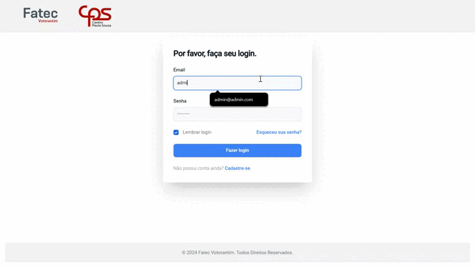
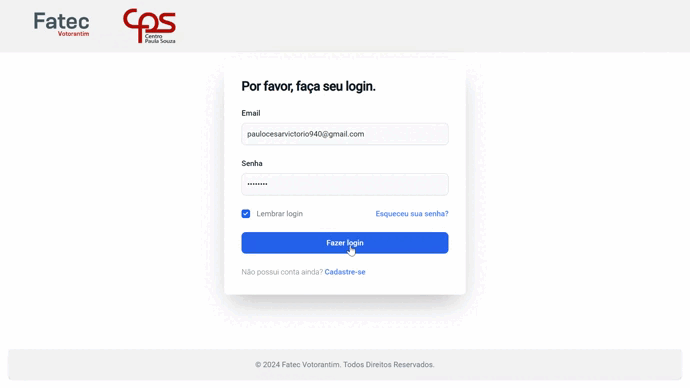

# Projeto de Compras 
<br id="topo">
<p align="center">
    <a href="#sobre">Sobre</a>  |  
    <a href="#backlogs">Backlogs & User Stories</a>  |
    <a href="#prototipo">Protótipo & Documentação</a>  | 
    <a href="#link">Links Uteis</a>  |
    <a href="#tecnologias">Tecnologias</a>  |  
    <a href="#equipe">Equipe</a>  |
     
    
</p>

<span id="sobre">

## :bookmark_tabs: Sobre
A partir de pedidos do administrativo da Faculdade de Tecnologia de Votorantim, o desenvolvimento desta aplicação ocorre para facilitar o trabalho do funcionário responsável pelo trabalho de compras. Consiste em um sistema de 2 frentes: a do **funcionário geral**, que pode gerar um pedido para um produto e acompanhar o andamento do pedido e o **funcionário de compras**, que visualiza pedidos realizados e os processa, mantendo o **funcionário geral** informado.

>_Projeto baseado na metodologia ágil SCRUM, procurando desenvolver a Produtividade e Colaboração entre funcionários da instituição_

Baseado em necessidades apontadas por funcionários, o usuário utilizará o sistema para armazenar dados que serão utilizados posteriormente em um novo pedido de compra, de forma que organize opções de compras e otimize tempo de pesquisa.

A partir desta ideia, o aplicativo utiliza de uma API desenvolvida para cadastrar produtos, sendo permitida a consulta, inclusão, mudança e exclusão de cada um.


:pushpin: Status do Projeto: **🧵 Em desenvolvimento** 

### 🏁 Entregas de Sprints
| Sprint | Previsão | Status | Histórico |
|:--:|:----------:|:----------------|:-------------------------------------------------:|
| 01 | 20/05/2024 |  ✔️Concluído    |[ver relatório](https://github.com/paulovictorio/Documentacao_projetoCompras/blob/sprint-01/README.md)|
| 02 | 03/06/2024 |  ✔️Concluído    |[ver relatório](https://github.com/paulovictorio/Documentacao_projetoCompras/blob/sprint-02/README.md)|
| 03 | 17/06/2024 |  ✔️Concluído    |[ver relatório](https://github.com/paulovictorio/Documentacao_projetoCompras/blob/sprint-03/README.md)|
| 04 | 18/05/2025 |  ✔️Concluído    |[ver relatório](https://github.com/DSM-Projeto-Compras/Documentacao/blob/sprint-04/README.md)|
| 05 | 05/06/2025 |  ✔️Concluído    |[ver relatório](https://github.com/DSM-Projeto-Compras/Documentacao/blob/sprint-05/README.md)|
| 06 | 17/06/2025 |   ✖Pendente     | Em andamento |

### :clapper: Apresentação Final
Confira a seguir uma demonstraão das funcionalidades para cada tipo de usuário do sistema:
<details>
   <summary>Diretor de Serviços Administrativos</summary>
    <div align="center">
        
    </div>
</details>
<details>
   <summary>Funcionários</summary>
    <div align="center">
          
    </div>
</details>
    
→ [Voltar ao topo](#topo)

<span id="backlogs">
    
## 👷 Backlogs & User Stories
### Requisitos Funcionais

| ID |      Título      |                    Descrição                         |            Exceções            |
|:--:|:-----------------:|:---------------------------------------------------:|:------------------------------:|
| RF01 | Realizar Cadastro | Cadastrar nome, email e senha | Alerta para email já existente |
| | | Retornar à página inicial por botão | Alerta para erro no cadastro |
| RF02 | Realizar Login | Inserir email e senha | Mensagem para usuário ou senha incorretos |
| | | Entrar no sistema por botão | Alerta para erro no login |
| | | Marcar opção "lembrar senha" | |
| | | Acessar botão "ir para cadastro" | |
| RF03 | Rodapé (mobile) | Acessar página de requisição, histórico e sair do sistema (usuário) | |
| | | Acessar página de criar um novo admin, histórico e sair do sistema (admin) | |
| RF04 | Requisitar produto | Pesquisar produto por caixa de texto| Alerta para erro na requisição |
| | | Pesquisar categoria por caixa de texto | |
| | | Inserir quantidade e descrição | | 
| | | Enviar requisição por botão | |
| RF05 | Visualização do histórico de pedidos | Visualizar dados do pedido | |
| | | Visualizar status do produto | |
| RF06 | Editar um pedido pendente (usuário) | Inserir quantidade, categoria, tipo e descrição | Alerta para erro na exclusão | 
| | | Excluir pedido | Alerta para erro na confirmação da edição |
| | | Confirmação da exclusão | |
| | | Confirmação da edição | |
| RF07 | Visualização dos detalhes de um pedido | Ver detalhes por botão | Alerta para erro na visualização dos detalhes |
| | | Voltar ao histórico por botão | |
| RF08 | Visualização da justificativa de um pedido negado | Ver justificativa por botão | Alerta para erro na visualização da justificativa |
| | | Voltar ao histórico por botão | Alerta para erro no envio da justificativa |
| | | Confirmar justificativa (administrador) | | 
| | | Descrever justificativa (administrador) em caixa de texto | |
| RF09 | Cadastro de novo usuário administrador | Inserir nome, email e senha | Alerta para erro ao criar conta |
| | | Criar conta por botão | Alerta para email já existente |
| RF10 | Lista de usuários administradores | Inserir dados de nome e email | Alerta para erro ao excluir usuário |
| | | Excluir usuário por botão| |
| RF11 | Alteração do status de um pedido (administrador) | Selecionar opções de "aprovar/negar" | Alerta para erro ao alterar status |
| | | Alterar visual do status para negado (vermelho) ou aprovado (verde) | |

 ### Requisitos Não Funcionais
|   ID  |             Título            |
|:-----:|:-----------------------------:|
| RNF01 | Linguagens JavaScript e React |
| RNF02 | Uso da bibliotecas expo dev e react native paper para o mobile |
| RNF03 | Uso do framework nextjs para o web | 
| RNF04 | Uso de Banco de Dados SQLite para dados de usuários e requisições |
| RNF05 | Uso da API de pesquisa da BEC |
| RNF06 | Criptografia da senha dos usuários | 
| RNF07 | Segurança contra injeção de SQL |
| RNF08 | Sistema ativo a todo o tempo |
| RNF09 | Responsividade entre diferentes dispositivos móveis |
| RNF10 | Autenticação do usuário por SPA |
| RNF11 | Projeto disponível na nuvem |

## User Stories
|  Épico | ID |       Ator        |        Ação         | Motivo |
|:------:|:--:|:-----------------:|:-------------------:|:------:|
|   01   | 01 | Funcionario Geral | Realiza Cadastro    | Criar conta na aplicação |
|   02   | 02 | Funcionario Geral | Realiza Login       | Acessar a aplicação |
|   02   | 03 |   Administrador   | Realiza Login       | Acessar a aplicação |
|   03   | 04 | Funcionario Geral | Pesquisar produto   | Encontrar um produto para realizar um pedido |
|   03   | 05 | Funcionario Geral | Pesquisar produto   | Realizar consulta na BEC |
|   04   | 06 | Funcionario Geral | Escolher produto    | Escolher produto para adicioná-lo ao pedido |
|   05   | 07 | Funcionario Geral | Escrever descrição  | Definir uso e esclarecer possíveis dúvidas acerca do pedido |
|   06   | 08 | Funcionario Geral | Escolher quantidade | Escolher quantidade desejada do produto | 
|   07   | 09 | Funcionario Geral | Realizar pedido     | Solicitar a compra de um produto |
|   08   | 10 | Funcionario Geral | Visualizar pedidos  | Acompanhar o andamento do pedido |
|   08   | 11 |   Administrador   | Visualizar pedidos  | Gerenciar os pedidos realizados |
|   09   | 12 |   Administrador   | Alterar status      | Gerenciar os pedidos realizados |
|   09   | 13 |   Administrador   | Alterar status      | Especificar estágio do processo do pedido |
|   11   | 14 |   Administrador   | Cancelar pedido     | Dar o motivo do cancelamento
|   12   | 15 |   Administrador   | Realizar cadastros  | Cadastrar novos administradores
 

# Computação em Nuvem ☁️
## Requisitos do Projeto:
|  ID  |                Requisito                  |      Status     |                                Observação                               |
|:----:|:-----------------------------------------:|:--------------:|:------------------------------------------------------------------------:|
|  01  | Persistência das informações em um BD SQL | 🟨 Parcial     | Instância RDS gerada na nuvem, mas não vinculada                         |
|  02  | Deploy do Back e Front na AWS             | 🟩 OK          | |
| 02.3 | Integração docker front e back na AWS     | 🟩 OK          | Docker padrão do projeto vinculado, mas não adaptado                     |
|  03  | Integração Back, Front e BDs na AWS       | 🟨 Parcial     | Back e Banco de dados mongo integrados                                   |
|  04  | Monitoramento e observabilidade do Back   | 🟩 OK          | |
|  05  | Feature para upload de objetos            | 🟥 Pendente    | |
|  06  | Armazenamento de objeto no S3             | 🟨 Parcial     | Buckets criados e funcionais, mas não integrados ao projeto              |
|  07  | Utilizar API Gateway                      | 🟥 Pendente    | |
|  08  | Documentação da implementação             | 🟥 Pendente    | |
|  09  | Estimativa de custos para a arquitetura   | 🟥 Pendente    | |
|  10  | Gestão dos custos                         | 🟨 Parcial     | Gestão primária de custos realizada e avaliada pelo painel da AWS        |
|  11  | Gerenciamento de IAM                      | 🟨 Parcial     | Perfis criados mas não implementados                                     |
|  12  | Criação do cenário TO-BE de policies      | 🟥 Pendente    | |


## Desenho da arquitetura:


→ [Voltar ao topo](#topo)

    
## Protótipo e Documentação
### 🏠 Protótipo 
<span id="prototipo">
    Com base nos dados coletados em pesquisas, foi possível montar um protótipo de alta fidelidade com o uso da ferramenta Figma. Esta ferramenta possibilitou uma visualização prévia do front-end do projeto, o suficiente para obter o alinhamento entre a equipe de desenvolvimento e o cliente. Desta forma, o projeto prototipado possui algumas funções básicas de acesso a telas e respostas a cliques em botões, posteriormente sendo funcionalidades aplicadas na própria aplicação.
    </br></br>
    
|  | <a href="https://www.figma.com/proto/aoRbpLGfGNXeTD0hLtrsDr/Projeto-Integrador?node-id=0-1&t=P5UiG1z4EAXU1bLR-1" target="_blank"> Protótipo Web </a> |
|:--------------------------------------------------:|:-------------:|
|  | <a href="https://www.figma.com/design/KKRDaOJgsXiG5Q4ichvzfQ/Projeto-Compras?node-id=0-1&p=f&t=hgiUnqmjhIiXskLV-0" target="_blank"> Protótipo Mobile </a>|


### 🐳 Docker
<span id="docker">
    Este projeto também possui contêineres e imagens docker, permitindo replicar o software tal como planejado. Para isso, se encontram em cada repositório Frontend e Backend um arquivo Dockerfile, que contém instruções gerais de como inicializar o projeto, e um arquivo docker-compose, que possui uma forma automatizada de inicializar o projeto.
    Para gerar e iniciar uma imagem e container docker, basta inserir em um terminal aberto para cada repositório:
    
```bash
docker-compose up --build
``` 
    

### 📄 Documentação 
As documentações deste projeto possuem mais detalhes do planejamento e da arquitetura do software. 
Elas podem ser acessadas pelos links: [Documentação do projeto](documentacao_compras_pi.pdf)
E [Documentação ihc](ihc_compras.pdf). <br>

<span id="link">
    
> 🔗 **Links gerais** <br>
> - Link do sistema funcional: [clique aqui para acessar](https://front-end-five-kappa.vercel.app/pages/login)
> - Repositório do projeto (FrontEnd): [clique aqui para acessar](https://github.com/DSM-Projeto-Compras/FrontEnd)
> - Organização do projeto no GitHub: [clique aqui para acessar](https://github.com/DSM-Projeto-Compras)


## 🛠️ Tecnologias Utilizadas 
<span id="tecnologias">
    <p align="center">
      <a href="https://skillicons.dev">
    
  </a>
</p>
</span>


## :busts_in_silhouette: Equipe


<span id="equipe">
    

|    Função     |                  Nome                 |                          GitHub                              | 
| :-----------: | :-----------------------------------: | :----------------------------------------------------------: |
| Product Owner | Paulo César Ap. Q. V. Victório        |[](https://github.com/paulovictorio)|
| Dev Team | Eduardo Brando Almeida                     |[](https://github.com/Eduardo-Brando-Almeida)|
| Dev Team  | Felipe Thiago da Silva                    |[](https://github.com/Felipe-Thiago)|
| Dev Team | Thiago Saldanha Diegoli                    |[](https://github.com/thiago-diegoli)|
| Dev Team | Yara Paes de Bona                          |[](https://github.com/YaraPaesB)|

→ [Voltar ao topo](#topo)


## 📃 Licença

The MIT License (MIT) 2024
